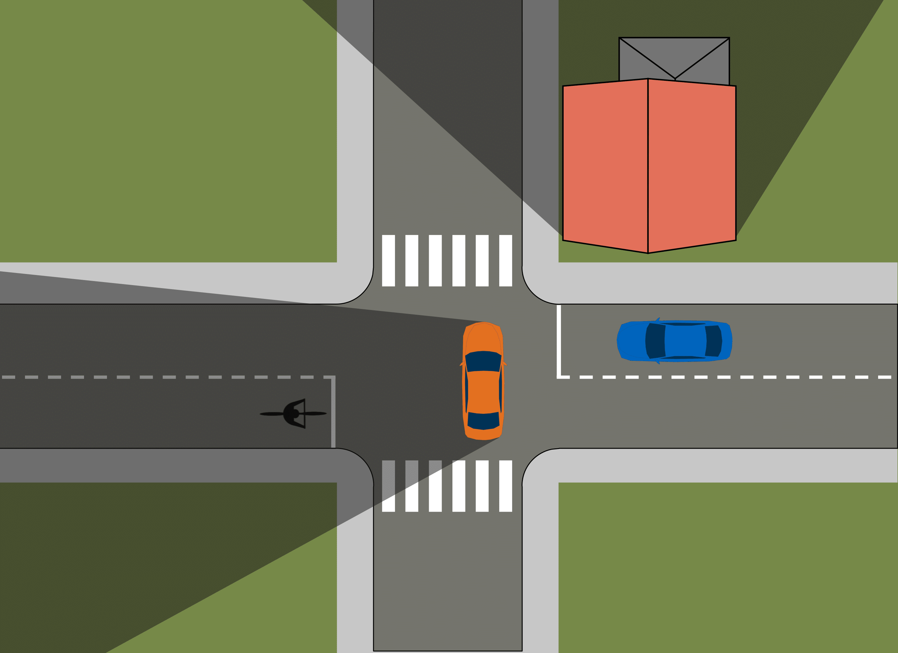
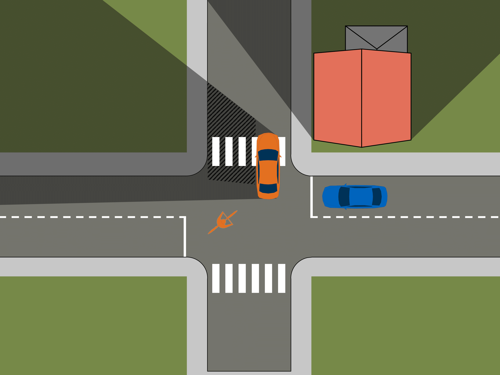
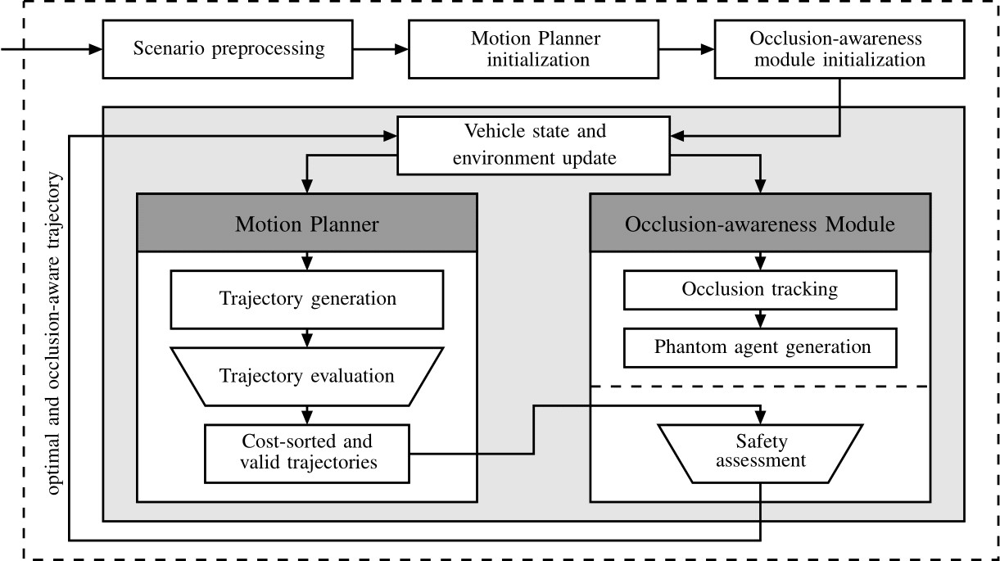

<!-- [](https://zenodo.org/records/10078062) -->

[](https://www.linux.org/)
[](https://www.python.org/downloads/release/python-3110/) [](https://www.python.org/downloads/release/python-3100/)
[](http://perso.crans.org/besson/LICENSE.html)

# Frenetix Occlusion Aware Motion Planner 
### Welcome to the Frenetix - Occlusion Aware Motion Planner!

 

This repository builds upon the Frenet trajectory planning algorithm provided by [Frenetix](https://github.com/TUM-AVS/Frenetix/) and extends it with pedestrian-aware motion planning capabilities. It introduces enhancements to integrate pedestrian interactions directly into the planning process, aiming to improve trajectory safety and efficiency in scenarios with vulnerable road users. 


---

## 🖥️ Framework

<details>
<summary>Click to expand</summary>

The Frenetix - Occlusion Aware Motion Planner is a modular framework that combines the Frenetix trajectory planning algorithm with occlusion-aware motion planning. 
The framework is designed to provide a comprehensive solution for motion planning in complex, occluded urban environments. It integrates the following key components:



</details>

---

## 🔧 Requirements & Pre-installation Steps

<details>
<summary>Click to expand</summary>

### Requirements
The software is developed and tested on recent versions of Linux. We strongly recommend using [Ubuntu 22.04](https://ubuntu.com/download/desktop) or higher. For the Python installation, we suggest the usage of Virtual Environment with Python 3.12, Python 3.11, or Python 3.10. For the development IDE, we suggest [PyCharm](http://www.jetbrains.com/pycharm/).

### 1. Pre-installation Steps
Make sure that the following **dependencies** are installed on your system for the C++ implementation:
   - [Eigen3](https://eigen.tuxfamily.org/dox/):
     ```bash
     sudo apt-get install libeigen3-dev
     ```
   - [Boost](https://www.boost.org/):
     ```bash
     sudo apt-get install libboost-all-dev
     ```
   - [OpenMP](https://www.openmp.org/):
     ```bash
     sudo apt-get install libomp-dev
     ```
   - [Python Development Tools](https://packages.ubuntu.com/jammy/python3.10-full):
     ```bash
     sudo apt-get install python3.11-full python3.11-dev
     ```

### 2. **Clone** this repository and create a new virtual environment:
   ```bash
   git clone <repository-url>
   cd <repository-folder>
   ```

   ```bash
   python3.11 -m venv venv
   source venv/bin/activate
   ```

### 3. Install all required packages


#### Installation with pip
Alternatively, you can install the project's requirements using pip:
```bash
pip install .
```
   [Frenetix](https://pypi.org/project/frenetix/) should be installed automatically. If not, please contact [Korbinian Moller](mailto:korbinian.moller@tum.de).

### 4. **Optional**: Download additional scenarios [here](https://gitlab.lrz.de/tum-cps/commonroad-scenarios.git).

</details>

---

## 🚀 Frenetix-Motion-Planner Step-by-Step Manual
<details>
<summary>Click to expand</summary>

1. Do the **Requirements & Pre-installation Steps**.

2. **Change** Settings in `main.py` if needed. Note that not all configuration combinations may work.

3. Adapt **configurations** if needed: You can find them in `configurations/frenetix_motion_planner` and `configurations/simulation`.

4. **Run** Frenetix - Occlusion Aware Motion Planner:
   ```bash
   python3 main.py
   ```
5. Change occlusion aware motion planning settings in `configurations/simulation/occlusion` if needed

</details>

---

## 🎮 Demonstration

<details>
<summary>Click to expand</summary>

You probably have to reopen the Readme to see the gifs.


</details>

---

## 📈 Test Data
<details>
<summary>Click to expand</summary>

Additional scenarios can be found [here](https://commonroad.in.tum.de/scenarios).

</details>

---

## 🔧 Modules

<details>
<summary>Click to expand</summary>

Detailed documentation of the functionality behind the single modules can be found below:

1. [General Planning Algorithm](README.md)
2. [Frenetix C++ Trajectory Handler](https://github.com/TUM-AVS/Frenetix)
3. [Pedestrian Simulator](https://github.com/TUM-AVS/PedestrianSimulator)
3. [Commonroad Scenario Handler](cr_scenario_handler/README.md)
6. [Wale-Net](https://github.com/TUMFTM/Wale-Net)
7. [Risk-Assessment](https://github.com/TUMFTM/EthicalTrajectoryPlanning)

</details>

---

# 📇 Contact Info

<details>
<summary>Click to expand</summary>

[Korbinian Moller](mailto:korbinian.moller@tum.de),
Professorship Autonomous Vehicle Systems,
School of Engineering and Design,
Technical University of Munich,
85748 Garching,
Germany

[Johannes Betz](mailto:johannes.betz@tum.de),
Professorship Autonomous Vehicle Systems,
School of Engineering and Design,
Technical University of Munich,
85748 Garching,
Germany

</details>

---

## 📃 Citation

<details>
<summary>Click to expand</summary>

If you use this repository in your research, please cite our related papers:


### Occlusion Aware Motion Planning (arXiv PrePrint)
```bibtex
@misc{Moller2025,
  doi = {10.48550/ARXIV.2504.01408},
  author = {Moller,  Korbinian and Schwarzmeier,  Luis and Betz,  Johannes},
  keywords = {Robotics (cs.RO),  Computer Vision and Pattern Recognition (cs.CV),  FOS: Computer and information sciences,  FOS: Computer and information sciences},
  title = {From Shadows to Safety: Occlusion Tracking and Risk Mitigation for Urban Autonomous Driving},
  publisher = {arXiv},
  year = {2025},
  copyright = {Creative Commons Attribution Non Commercial No Derivatives 4.0 International}
}
```

### Frenetix Motion Planner
```bibtex
@ARTICLE{Frenetix2024,
  author={Trauth, Rainer and Moller, Korbinian and Würsching, Gerald and Betz, Johannes},
  journal={IEEE Access}, 
  title={FRENETIX: A High-Performance and Modular Motion Planning Framework for Autonomous Driving}, 
  year={2024},
  volume={12},
  number={},
  pages={127426-127439},
  keywords={Trajectory;Planning;Trajectory planning;Heuristic algorithms;Vehicle dynamics;Autonomous vehicles;Machine learning algorithms;Collision avoidance;Autonomous vehicles;collision avoidance;trajectory planning},
  doi={10.1109/ACCESS.2024.3436835}}

```

</details>

---

# 👥 Code Contributors

<details>
<summary>Click to expand</summary>

#### Pedestrian Aware Motion Planning
[Korbinian Moller](mailto:korbinian.moller@tum.de) \
[Luis Schwarzmeier](mailto:luis.schwarzmeier@tum.de)  

#### Framework & Frenetix
[Rainer Trauth](mailto:rainer.trauth@tum.de) \
[Korbinian Moller](mailto:korbinian.moller@tum.de) \
[Marc kaufeld](mailto:marc.kaufeld@tum.de)  


</details>

